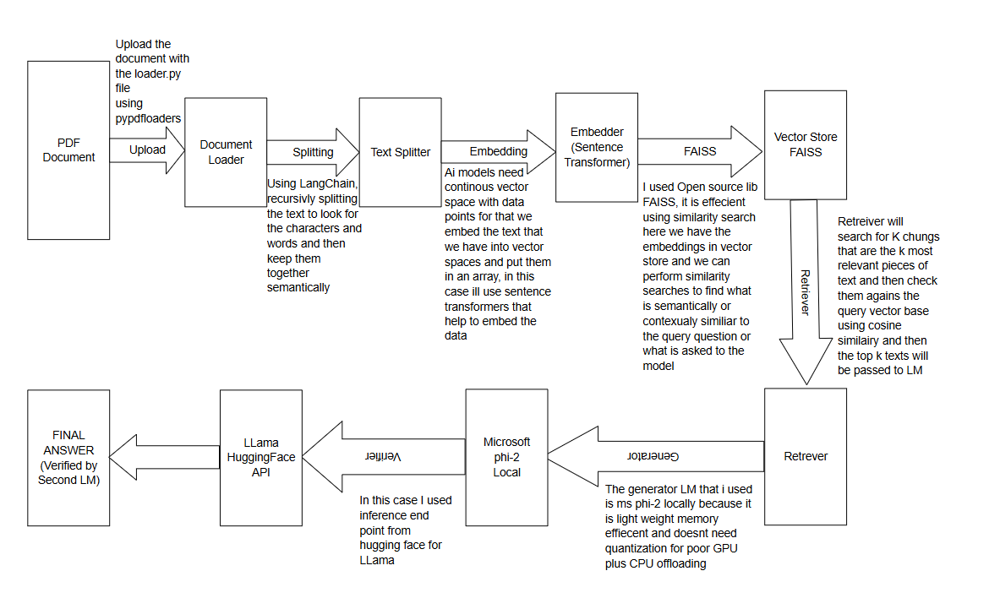
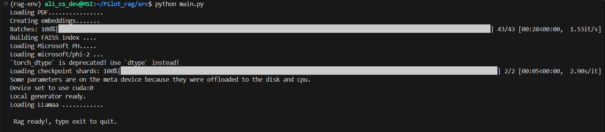
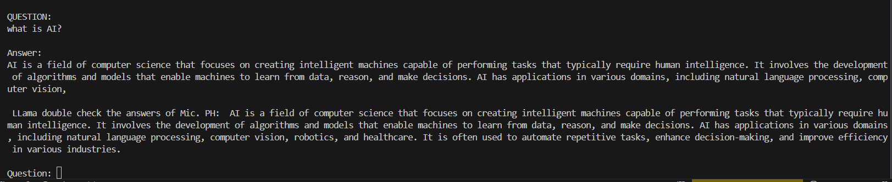

# RAG Project Using two Models

I created a lightweight RAG pipeline as a pilot project for Ailt. The system takes text from pdf, a generator model is used localy to answer user query and second model is used as a verifier to reduce Hallucinations and give accurate answer via API inference

## Project Architecture

## Resources and References that I used:

Following are the resources that I used including ChatGPT for initial project structure and scaffolding:

- https://www.python.org/
- Miniconda - https://docs.anaconda.com/miniconda/
- Pytorch (CUDA) - https://pytorch.org/get-started/locally/
- LangChain - https://python.langchain.com/
- FAISS - https://github.com/facebookresearch/faiss/wiki
- PyPDFLoader (LangChain Community) - https://api.python.langchain.com/en/latest/document_loaders/langchain_community.document_loaders.pdf.PyPDFLoader.html

- Sentence Transformers - https://www.sbert.net/
- Microsoft Phi-2 (local generator) - https://huggingface.co/microsoft/phi-2
- Meta LLaMA 3 (verifier via Hugging Face API) - https://huggingface.co/meta-llama/Meta-Llama-3-8B
- FAISS Index (LangChain) - https://python.langchain.com/docs/integrations/vectorstores/faiss/
- all-mpnet-base-v2(embeddings) - https://huggingface.co/sentence-transformers/all-mpnet-base-v2
- Hugging face and inference API - https://huggingface.co/docs/huggingface_hub/index
- Moqups (Pipeline Diagram) - https://moqups.com/
- Hugging Face Transformers - https://huggingface.co/docs/transformers/index
- Optimum and AWQ(for quantization experiments) - https://huggingface.co/docs/optimum/index

## Challenges I faced:

- GPU Performance Constraints when running the model localy due to less VRAM 4b of RTX 3050 and had compatibility issues with optimum when initially tested mistral7B in 4 bit quantization
- I also faced environment conflicts then i had to switch to older python version
- PHi 2 performance is ok but accuracy is questionable.

## Screenshots:

## Performance:

On average the response of both models that was generated was timed around 384.93 seconds
Meanwhile the whole Pipline took 480.51 seconds
